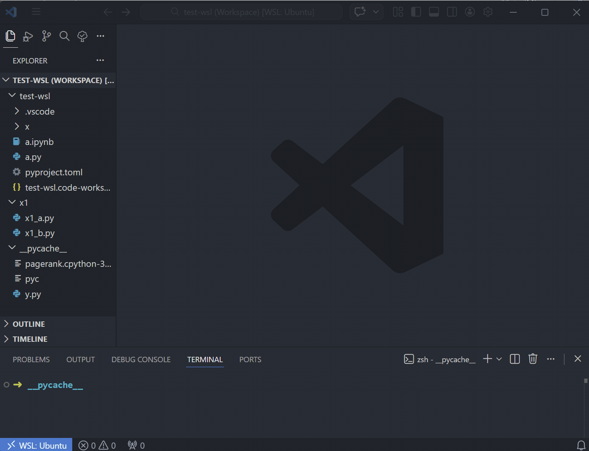

# trash4wsl-in-vscode 

<pre align="center"> 简体中文  |  <a href="https://github.com/2bitbit/trash4wsl-in-vscode/blob/main/docs/README_en.md">English</a></pre>
在VSCode WSL(或其他 remote 连接)中，再也不用担心永久误删文件无法后悔，现在有了迷人的回收站（基于 trash-cli 实现）。

在VSCode WSL(或其他 remote 连接)中，再也不用担心误删文件造成的不可逆损失。现在有了一个迷人且极速安全的**原生回收站**（基于底层 Rust Native API 高性能重写，免依赖）。

## 功能特色
- 支持多根工作区
- 支持删除、搜索、恢复、清空
- 支持 WSL、其他remote连接
- 支持快捷键（默认是`delete`删除选中文件，`ctrl+shift+delete`打开回收站面板）
- 简洁的 GUI
- 🚀 **纯原生极速实现**：底层引擎通过 `NAPI-RS` + Rust `trash` 构建，无缝衔接系统底层，极限提升响应速度。
- 📦 **零前置依赖配置**：摆脱由于外部 `trash-cli` 库未安装造成的不能用，真正实现“安装即用”。
- 🎨 **精美的系统级视图面板**：抛弃简陋的弹窗，内置专属大体量沉浸式历史视窗（支持文件分类展示、一键隔离恢复、危险级全部清空）。
- 🛡️ **严格的安全拦截保护**：全原生参数传递，免疫所有的系统级 Shell 执行注入。
- 支持各种基于 WSL 的操作系统以及遵循 FreeDesktop XDG 的各大远程发行版。
- 顺手的键盘绑定（默认选中时按 `delete` 下发垃圾桶，`ctrl+shift+delete` 打开大屏管理面板）。
## 如何使用
1. 直接在 VSCode Marketplace 搜索 `trash4WSL-in-vscode` 并安装插件（**不再需要在内部自装任何环境依赖**）。
2. 在左侧资源管理器中选中你想清理的文件（支持多选），右键选择 `丢入回收站 (Trash)`，或者直接施放快捷键 `delete` 即可删除。
3. `ctrl+shift+p` 执行命令或使用快捷键 `ctrl+shift+delete`，将在主编辑区打开宏伟的「工作区回收站」详情面板，进行相关后悔药操作。

>温馨提示：其底层标准严格遵守 FreeDesktop Trash 规范体系，所以你在插件内删除的数据、都会无缝与系统桌面默认回收站生态共存（存放路径通常为：`~/.local/share/Trash/`）。

## 环境
- 支持新版 VSCode
- Linux (x64 / arm64)

若这个插件保护了您的重要代码，请在 GitHub 上大方地赐予一颗星星哦 ⭐，这对我是莫大的动力激励。

<strong>Enjoy! 祝愿你早安午安晚安</strong>

Co-build with <strong>AI</strong>

