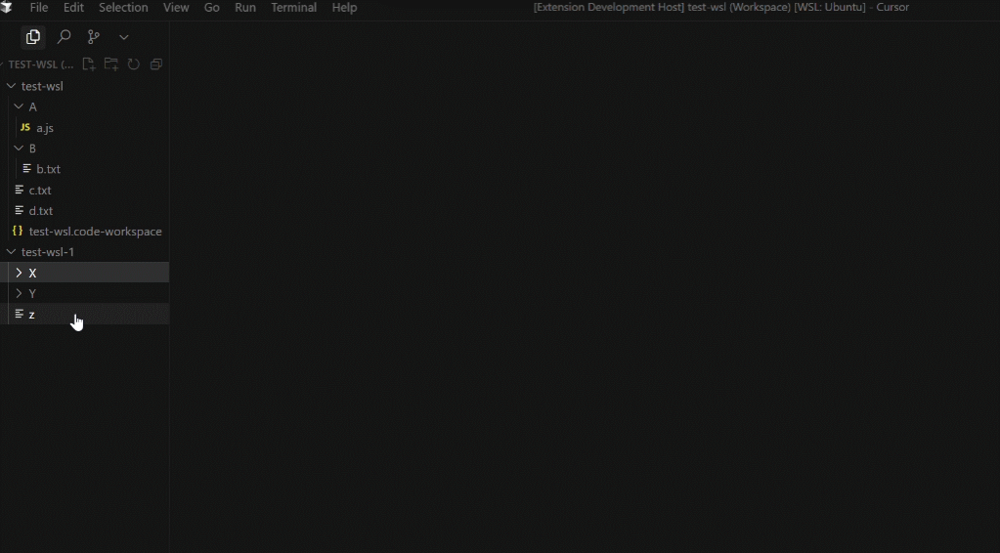

# trash4WSL-in-vscode
<pre align="center"> 简体中文  |  <a href="./docs/README_en.md">English</a></pre>
在VSCode WSL(或其他 remote 连接)中，再也不用担心永久误删文件无法后悔，现在有了迷人的回收站（基于 trash-cli 实现）。

## 功能特色
- 支持多根工作区
- 支持删除、搜索、恢复、清空
- 支持 WSL、其他remote连接
- 支持快捷键（默认是`delete`删除选中文件，`ctrl+shift+delete`打开回收站面板）
- 简洁的 GUI

## 如何使用
1. 在目标环境终端 `apt install trash-cli` 安装 trash-cli
2. 在 VSCode Marketplace 搜索 `trash4WSL-in-vscode` 安装此插件到工作区
3. 选中文件，右键选择 `trash-put (via trash-cli)` 或使用快捷键 `delete` 删除选中文件
4. `ctrl+shift+p` 或使用快捷键`ctrl+shift+delete`打开回收站面板进行相关操作

>温馨提示：默认回收站目录在 `~/.local/share/Trash/files`下。

## 依赖
- trash-cli
- VSCode

<strong>Enjoy!祝愿你早安午安晚安</strong>

Co-build with <strong>AI</strong>

