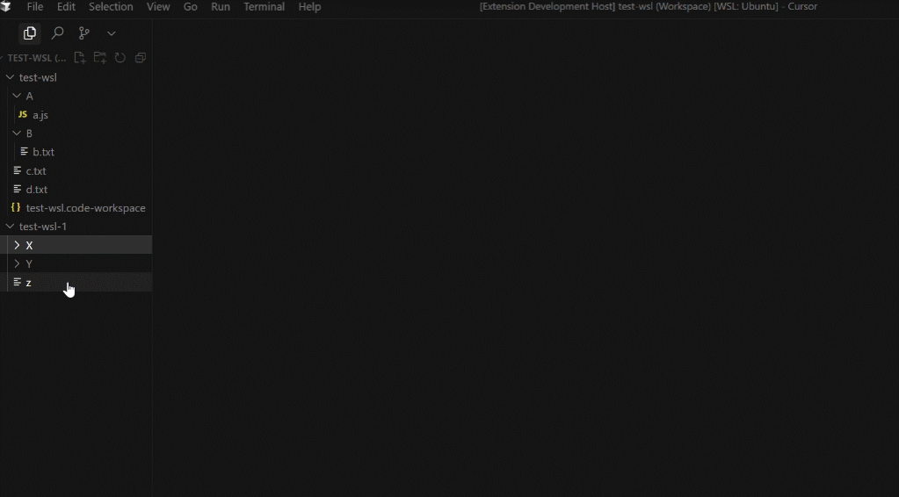

# trash4wsl-in-vscode

<pre align="center"> <a href="../README.md">简体中文</a>  |  English</pre>

In VSCode WSL (or other remote connections), no more worries about permanent file deletion without regret. Now enjoy a charming recycle bin (based on trash-cli implementation).

## Features
- Support for multi-root workspaces
- Support for delete, search, restore, and empty operations
- Support for WSL and other remote connections
- Support for shortcuts (default: `delete` to delete selected files, `ctrl+shift+delete` to open trash panel)
- Clean and simple GUI

## How to Use
1. Install trash-cli in the target environment terminal: `apt install trash-cli`
2. Search for `trash4wsl-in-vscode` in VSCode Marketplace and install this extension to your workspace
3. Select files, right-click and choose `trash-put (via trash-cli)` or use the shortcut `delete` to delete selected files
4. Use `ctrl+shift+p` or the shortcut `ctrl+shift+delete` to open the trash panel for related operations

>Tip: The default trash directory is located at `~/.local/share/Trash/files`.

## Dependencies
- trash-cli
- VSCode

<strong>Enjoy! Wishing you good morning, good afternoon, and good night</strong>

Co-build with <strong>AI</strong>

